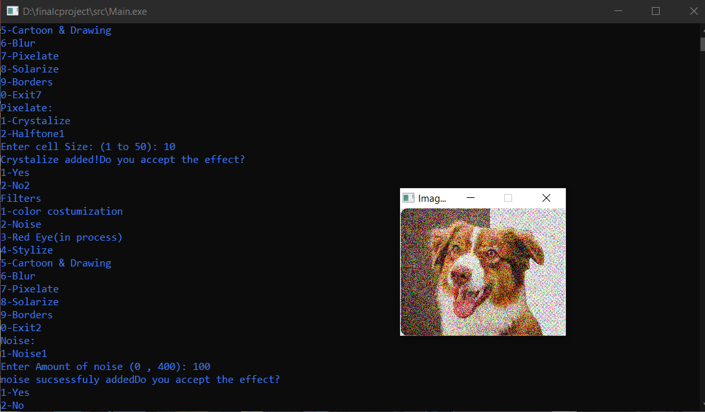

# Image Processing Using C

Image Processing App with Url and Email input as well as local Files. It has more than 15 Filters of photoshop and supports jpeg , png and bitmap files.

## How to Use

Simple just run Main.exe :)

#### environment Pic

## Note
1- this program doesn't have GUI and you should work with Command Promt & also may have some bugs that we try to fix it soon.

2- libraries used: (curl (for handling url downloading) , ctype , jpeglib , pnglib , SFML/Graphics.h (for handling image preview) ) note that they may have some dependencies!

License
=======

    Copyright 2023 Mohammad Sadra Sarparandeh & Shiva Zare
    Licensed under the Apache License, Version 2.0 (the "License");
    you may not use this file except in compliance with the License.
    You may obtain a copy of the License at

       http://www.apache.org/licenses/LICENSE-2.0

    Unless required by applicable law or agreed to in writing, software
    distributed under the License is distributed on an "AS IS" BASIS,
    WITHOUT WARRANTIES OR CONDITIONS OF ANY KIND, either express or implied.
    See the License for the specific language governing permissions and
    limitations under the License.